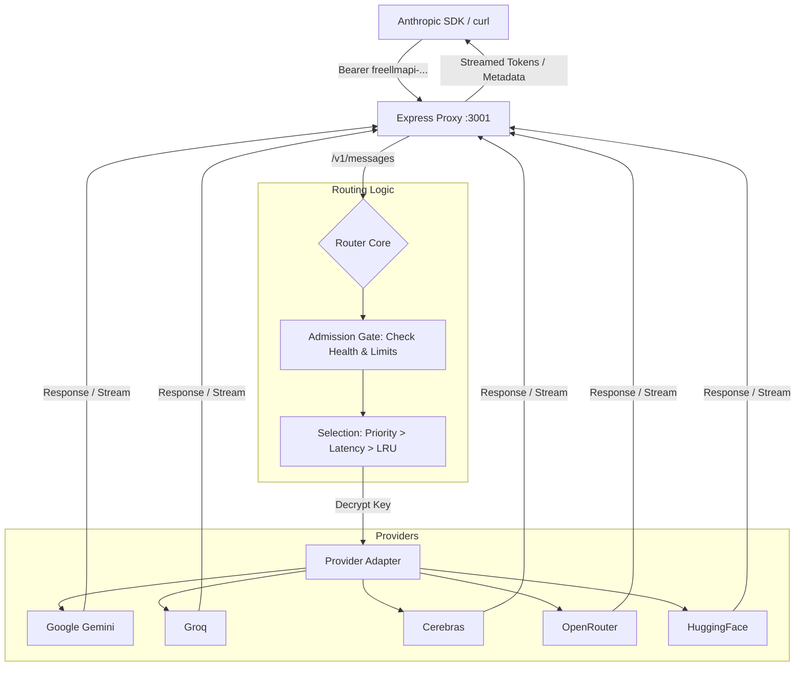

# System Architecture: LLMFreeAPIsRouter

## Overview
LLMFreeAPIsRouter acts as a high-availability proxy between LLM clients (using Anthropic SDKs) and various free-tier LLM providers. It translates requests, manages rate limits, and ensures failover.

## Visual Flow

## Key Components

### 1. Express Proxy
- Entry point for all client requests.
- Handles authentication and standardizes incoming Anthropic-format payloads.
- Manages SSE (Server-Sent Events) for streaming responses.

### 2. Router Core
- **Admission Gate:** Filters available providers based on real-time health status and calculated rate limits (RPM/TPM).
- **Selection Logic:** Implements `strict` (exact model match) or `flexible` (capability-tier match) routing.
- **Failover Engine:** Orhcestrates retries on 429/5xx errors and manages provider cooldowns.

### 3. Provider Adapters
- Modular components that implement a standard interface.
- Responsibility:
    - Translation of Anthropic Messages to Provider-specific APIs.
    - Extraction of rate-limit metadata from provider responses.
    - Error normalization to Anthropic error types.

### 4. Security Layer
- **Vault:** AES-256-GCM encryption for provider API keys.
- **Just-in-Time (JIT) Decryption:** Keys are only decrypted in memory at the moment of the request.
- **Auth Guard:** Validates client tokens and manages usage scopes.

## Data Flow (Request Lifecycle)
1. **Request Reception:** Proxy receives an Anthropic-compatible request.
2. **Authentication:** Proxy validates the `Authorization` bearer token.
3. **Routing Selection:** Router identifies the best healthy provider/key based on the `x-routing-mode` and model requested.
4. **Key Decryption:** The selected provider's API key is decrypted using the `MASTER_KEY`.
5. **Execution:** The Provider Adapter translates the request and calls the upstream API.
6. **Response Handling:**
    - **Success:** Upstream response is translated back to Anthropic format and returned with `x-actual-model` header.
    - **Failure (429/5xx):** Router triggers a cooldown for that key and retries with the next best candidate.
7. **Streaming:** Tokens are streamed directly to the client if requested, with "fail-fast" logic for mid-stream failures.
